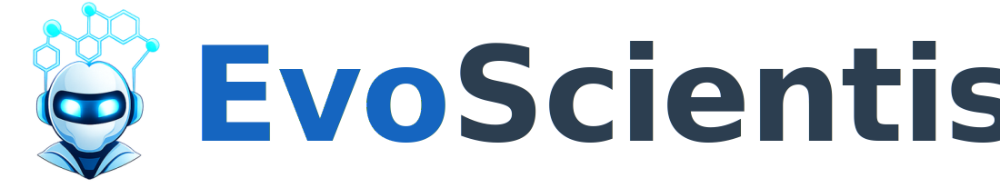

    <picture>
      <source media="(prefers-color-scheme: light)" srcset="../assets/logo-dark.svg">
      <source media="(prefers-color-scheme: dark)" srcset="../assets/logo-light.svg">
      
    </picture>

<h4><b>EvoScientist aims to harness vibe research by enabling self-evolving AI scientists that autonomously explore, generate insights, and iteratively improve.
It is designed to be opinionated and ready to use out of the box, offering a living research system that grows alongside evolving agent skills, toolsets, and memory bases.
Moving beyond traditional human-in-the-loop systems, EvoScientist adopts a human-on-the-loop paradigm, where AI acts as a research buddy that co-evolves with human researchers and internalizes scholarly taste and scientific judgment.</b></h4>

| Repository | Description |
| ---------- | ----------- |
| [**EvoScientist**](https://github.com/EvoScientist/EvoScientist) | Core multi-agent system for end-to-end automated scientific discovery. |
| [**EvoSkills**](https://github.com/EvoScientist/EvoSkills) | Official skill repository — 10 research-lifecycle skills from ideation to publication. |
